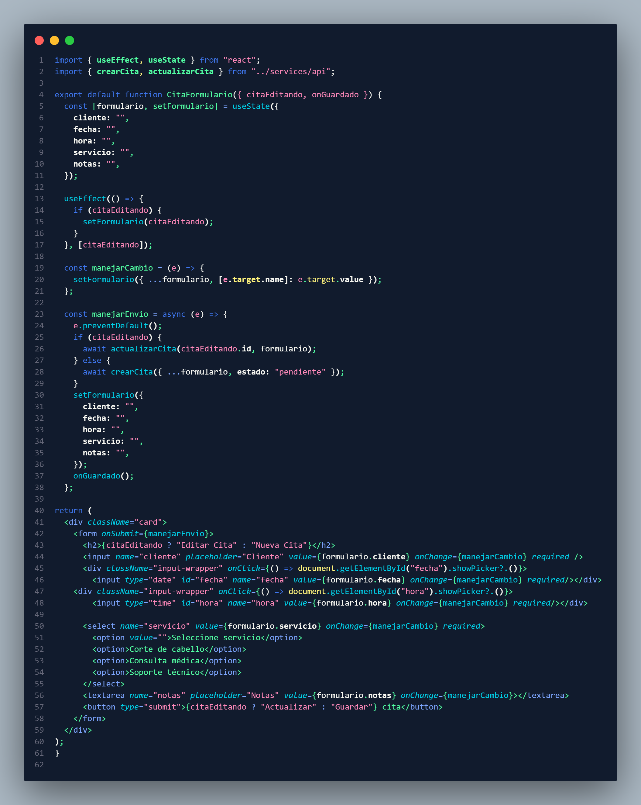

HOLAAAA!!! :D

# Proyecto Final React + NodeJs

## - Tecnologias -

* React + Vite
* NodeJs + Express + Sequelize
* Sqlite3
  
#### Creacion de un CRUD integrando BackEnd(Api) + FrontEnd(Cliente)

Se realizara un CRUD en base a un sistema de CITAS, las cuales seran para registrar ciertas citas que tengas agendadas en algun horario en especifico para no olvidar cuando tienes estas citas
como:

* Citas medicas
* Citas generales
* Soporte tecnico 

#### Vista General del Sistema 

# BackEnd (RUTAS)

#### Creacion de 4 rutas principales 
* CREAR - Se crea una cita la cual requiere de cliente,fecha,hora,servicio,notas 
* OBTENER - Se obtienen todos las citas que se encuentran registradas
* ELIMINAR - Se elimina una cita en especifico por medio de su ID
* ACTUALIZAR - Se actualiza la informacion de una cita - Requiere datos de actualizacion

#### Conexion a la DB 

#### Modelo para la tabla de sqlite3
Se crea el modelo para la tabla de sqlite3 para que el ORM entienda como esta construida, donde se colocan los campos de la tabla, tipos de datos y especificacion de checks especilaes como primary key o unique

# FrontEnd (Componentes)

#### Para el front se hizo uso de una estructura, creando carpetas para correcta administracion tales como services, components y pages

En services esta la api construida y conectada al backend despues siendo exportada para posteriormente ser consumida por otro commponente
Se puede observar la creacion y exportacion de 4 componentes cada uno con su URL del backend especifico a consumir

* obtenerCitas
* CrearCitas
* EliminarCitas
* ActualizarCitas

#### Componente app.jsx
Se puede observar como se mandan a llamar a los componentes secundarios para ya formar finalmente toda la pagina desde el app

#### Componente citaformulario.jsx
En este componente basicamente se crea el formulario asi donde se espera recibir los parametros antes mencionados para registrar una cita
* cliente
* fecha
* hora
* servicio
* notas

#### Componente citalista.jsx
En este componente basicamente se obtiene el registro del backend y apartir de ese registro se genera una tabla para poder mostrar la informacion conjunto a las acciones 
que son editar - eliminar  las cuales editar sirve para actualizar los registros y eliminar los elimina

